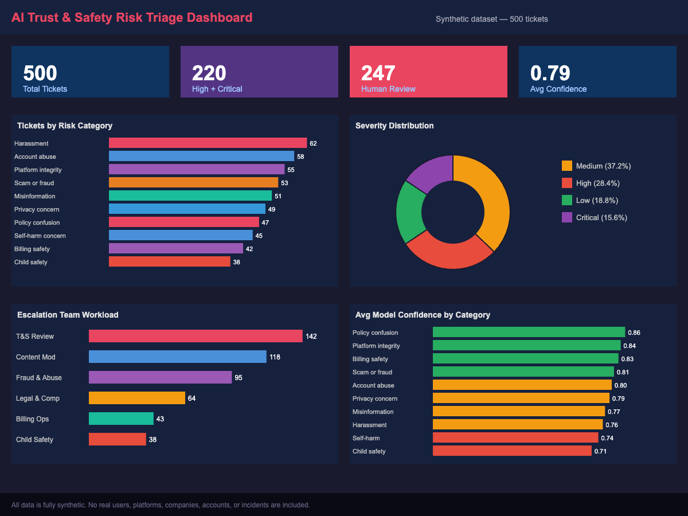

# AI Trust & Safety Operations Case Study

## Risk Triage, Taxonomy Design and Escalation Workflow

This project demonstrates how messy user reports can be transformed into a structured Trust & Safety triage workflow using taxonomy design, severity rules, escalation logic, SQL analysis, Python analytics, machine learning, dashboarding, and responsible AI safeguards.

The project uses a fully synthetic dataset of 500 user reports. No real users, platforms, companies, accounts, or incidents are included.

---

## Role Alignment: Trust & Safety Operations

This project demonstrates skills relevant to Trust & Safety, User Operations and AI risk workflows:

- triaging ambiguous user reports
- designing risk taxonomies and severity frameworks
- defining escalation pathways and SLA targets
- creating QA review standards
- analysing operational risk trends with SQL
- monitoring model confidence and human review demand
- designing dashboard metrics for operational health
- applying human-in-the-loop safeguards for sensitive cases
- using AI as reviewer support rather than final decision-maker

---

## Dashboard Preview



*Risk category and severity distribution across 500 synthetic user reports. Generated by `dashboard/create_dashboard_mockup.py`.*

---

## Project Summary

Trust & Safety teams often receive large volumes of unstructured user reports involving issues such as account abuse, scams, harassment, privacy concerns, misinformation, self-harm concerns, child safety risks, and policy confusion.

This project shows how those reports can be converted into structured operational signals:

- risk category
- subcategory
- severity level
- SLA target
- escalation team
- human review requirement
- final action
- model confidence
- reviewer summary

The goal is not to fully automate safety decisions. The goal is to show how AI and analytics can support human reviewers while keeping human judgement central for high-risk, sensitive, ambiguous, or low-confidence cases.

---

## Business Problem

Unstructured user reports can create operational challenges:

- inconsistent triage decisions
- delayed escalation of urgent risks
- unclear ownership between teams
- limited visibility of reviewer workload
- weak quality assurance
- missed high-risk cases
- unsafe over-reliance on automation
- poor tracking of model uncertainty

This project addresses those challenges by designing a structured AI-assisted triage workflow with responsible human-in-the-loop controls.

---

## Project Objectives

The project aims to demonstrate how to:

1. Design a Trust & Safety risk taxonomy.
2. Assign severity levels and SLA targets.
3. Route tickets to the correct escalation team.
4. Identify cases requiring human review.
5. Generate a synthetic dataset safely.
6. Analyse risk trends using SQL and Python.
7. Train a basic text classifier.
8. Create AI-assisted reviewer summaries.
9. Design a dashboard for operational monitoring.
10. Document responsible AI safeguards.

---

## Dataset

The dataset contains 500 fully synthetic user reports.

Main dataset:

```text
data/synthetic_user_reports.csv
```

Enriched dataset with reviewer summaries:

```text
data/synthetic_user_reports_with_summaries.csv
```

Each ticket includes:

| Field | Description |
|---|---|
| ticket_id | Unique synthetic ticket ID |
| created_at | Synthetic creation timestamp |
| user_report | Fictional user report text |
| risk_category | Primary Trust & Safety category |
| subcategory | More specific issue type |
| severity | Low, Medium, High, or Critical |
| sla_target_hours | Target review/action time |
| region | Synthetic region |
| channel | Synthetic intake channel |
| language | Report language label |
| model_confidence | Simulated model confidence score |
| escalation_team | Responsible review team |
| human_review_required | Human review flag |
| final_action | Final workflow action |

---

## Risk Categories

The taxonomy includes 10 primary risk categories:

| Risk Category | Example Issue |
|---|---|
| Account abuse | Unauthorised login or account takeover |
| Scam or fraud | Impersonation, phishing, suspicious payment request |
| Harassment | Threats, repeated unwanted contact, targeted abuse |
| Self-harm concern | Crisis language or concern for another user |
| Misinformation | Harmful or misleading claims |
| Privacy concern | Personal data exposure or unauthorised sharing |
| Billing safety escalation | Suspicious charges linked to risk |
| Policy confusion | User appeal or unclear moderation decision |
| Child safety concern | Possible risk involving a minor |
| Platform integrity | Spam, bots, fake accounts, coordinated abuse |

---

## Severity Framework

| Severity | SLA Target | Meaning |
|---|---:|---|
| Critical | 1 hour | Immediate or severe safety risk |
| High | 4 hours | Clear risk requiring specialist review |
| Medium | 24 hours | Plausible risk or unclear evidence |
| Low | 72 hours | Low-risk support or education issue |

High and Critical cases require human review.

---

## Project Structure

```text
.
├── dashboard/
│   ├── create_dashboard_mockup.py
│   ├── dashboard_notes.md
│   └── dashboard_summary_metrics.md
│
├── data/
│   ├── synthetic_user_reports.csv
│   └── synthetic_user_reports_with_summaries.csv
│
├── docs/
│   ├── data_dictionary.md
│   ├── escalation_decision_tree.md
│   ├── human_in_the_loop_process.md
│   ├── qa_checklist.md
│   ├── responsible_ai_safeguards.md
│   └── risk_taxonomy.md
│
├── images/
│   ├── dashboard_mockup.png
│   ├── dashboard_priority_queue.png
│   ├── risk_classifier_confusion_matrix.png
│   └── other generated analysis charts
│
├── models/
│   └── risk_classifier_pipeline.joblib
│
├── notebooks/
│   ├── 02_exploratory_analysis.py
│   └── 03_risk_classifier.py
│
├── reports/
│   ├── eda_summary.md
│   ├── final_recommendations_report.md
│   ├── risk_classifier_summary.md
│   └── ticket_summariser_examples.md
│
├── sql/
│   └── trust_safety_analysis.sql
│
├── src/
│   ├── ai_ticket_summariser.py
│   └── generate_synthetic_tickets.py
│
├── requirements.txt
└── README.md
```

Some output files are generated by running the scripts. If they are not visible in the repository yet, they can be recreated from the source code.

---

## Documentation

The docs/ folder contains the operational design foundation for the project.

| Document | Purpose |
|---|---|
| risk_taxonomy.md | Defines categories, subcategories, severity levels, and routing principles |
| escalation_decision_tree.md | Shows how tickets move from intake to escalation |
| qa_checklist.md | Defines quality assurance checks and scoring |
| human_in_the_loop_process.md | Explains where human judgement is required |
| responsible_ai_safeguards.md | Documents responsible AI controls and limitations |
| data_dictionary.md | Defines every dataset field |

---

## SQL Analysis

SQL analysis is stored in:

```text
sql/trust_safety_analysis.sql
```

The SQL file includes analysis for:

- data quality checks
- risk category distribution
- severity distribution
- human review demand
- model confidence
- escalation team workload
- SLA targets
- channel and region patterns
- final action distribution
- priority review queue
- responsible AI safeguard checks
- executive summary outputs

---

## Python Analysis

Exploratory analysis script:

```text
notebooks/02_exploratory_analysis.py
```

This produces:

- data quality checks
- summary tables
- risk category charts
- severity charts
- escalation workload charts
- human review charts
- model confidence charts
- EDA summary report

Risk classifier script:

```text
notebooks/03_risk_classifier.py
```

This trains a basic machine learning classifier using:

- TF-IDF vectorisation
- Logistic Regression
- train/test split
- classification report
- confusion matrix
- top predictive features

The classifier predicts:

```text
risk_category
```

from:

```text
user_report
```

---

## AI-Assisted Ticket Summariser

The summariser is stored in:

```text
src/ai_ticket_summariser.py
```

It generates structured reviewer summaries for synthetic tickets.

Each summary includes:

- ticket summary
- risk rationale
- recommended reviewer next step
- SLA note
- human review note

The summariser does not use a live AI API. It uses deterministic templates to keep the project reproducible and safe for public portfolio use.

---

## Dashboard

Dashboard planning is stored in:

```text
dashboard/dashboard_notes.md
```

Dashboard mockup generator:

```text
dashboard/create_dashboard_mockup.py
```

The dashboard is designed to monitor:

- total ticket volume
- High and Critical tickets
- human review requirement
- low-confidence predictions
- tickets by risk category
- tickets by severity
- escalation team workload
- average model confidence by category
- final action distribution
- priority review queue

Recommended dashboard title:

```text
AI Trust & Safety Risk Triage Dashboard
```

---

## Responsible AI Safeguards

This project treats AI as reviewer support, not as the final decision-maker.

Human review is required for:

- High severity tickets
- Critical severity tickets
- child safety concerns
- self-harm or crisis concerns
- fraud or scam reports
- privacy exposure
- account compromise
- credible threats
- low-confidence predictions
- ambiguous or multi-risk reports

Responsible AI controls include:

- fully synthetic data
- no real personal information
- human-in-the-loop review
- model confidence thresholding
- severity floors
- QA sampling
- escalation audit trail
- human override logic
- limitations clearly documented

---

## How to Run the Project

### 1. Clone the repository

```bash
git clone https://github.com/yenlikgaisina/trust-safety-risk-triage-ai-reports.git
cd trust-safety-risk-triage-ai-reports
```

### 2. Install dependencies

```bash
pip install -r requirements.txt
```

### 3. Generate the synthetic dataset

```bash
python src/generate_synthetic_tickets.py
```

This creates:

```text
data/synthetic_user_reports.csv
```

### 4. Run exploratory analysis

```bash
python notebooks/02_exploratory_analysis.py
```

This creates charts and:

```text
reports/eda_summary.md
```

### 5. Train the risk classifier

```bash
python notebooks/03_risk_classifier.py
```

This creates:

```text
reports/risk_classifier_summary.md
images/risk_classifier_confusion_matrix.png
models/risk_classifier_pipeline.joblib
```

### 6. Generate AI-assisted ticket summaries

```bash
python src/ai_ticket_summariser.py
```

This creates:

```text
data/synthetic_user_reports_with_summaries.csv
reports/ticket_summariser_examples.md
```

### 7. Generate dashboard mockup

```bash
python dashboard/create_dashboard_mockup.py
```

This creates:

```text
images/dashboard_mockup.png
images/dashboard_priority_queue.png
dashboard/dashboard_summary_metrics.md
```

---

## Key Recommendations

The final recommendations report is available here:

```text
reports/final_recommendations_report.md
```

Main recommendations:

1. Use the taxonomy as the foundation of the triage workflow.
2. Apply severity floors for sensitive risks.
3. Keep human review mandatory for high-impact cases.
4. Monitor model confidence by category.
5. Build a priority review queue.
6. Use QA reviews to improve the system.
7. Make responsible AI metrics visible in dashboards.
8. Add future SLA outcome fields.
9. Expand the classifier carefully.
10. Position the project as AI Operations and Trust & Safety workflow design, not only as data science.

---

## What I Would Improve in a Real Production Environment

In a real Trust & Safety environment, I would extend this project by adding:

- real outcome fields such as resolution time, SLA breach status and reviewer decision
- inter-rater agreement metrics between reviewers
- policy version tracking
- false positive and false negative analysis
- reviewer calibration sessions
- audit logs for human overrides
- stronger privacy and access controls
- live dashboarding in Power BI, Looker or Tableau
- continuous feedback loops between reviewers, policy and model teams

---

## Limitations

This project is for portfolio and educational purposes only.

Limitations:

- all data is synthetic
- no real user reports are used
- no real platform or company data is included
- no live moderation system is connected
- model confidence values are simulated in the dataset
- the classifier is trained on simplified synthetic reports
- real Trust & Safety cases would be more complex and ambiguous
- the system is not production-ready
- legal, privacy, safety, and policy review would be required for real-world use

---

## Skills Demonstrated

This project demonstrates skills in:

- Trust & Safety operations
- AI risk triage
- taxonomy design
- escalation workflow design
- SLA mapping
- quality assurance design
- human-in-the-loop AI
- responsible AI safeguards
- SQL analysis
- Python data analysis
- text classification
- model evaluation
- dashboard planning
- operational reporting
- data storytelling
- AI Operations thinking

---

## Portfolio Positioning

This project is best positioned as:

> An AI Operations and Trust & Safety case study showing how messy user reports can be transformed into structured risk categories, escalation decisions, QA checks, reviewer summaries, dashboard metrics, and responsible human-in-the-loop workflows.

This makes the project relevant for roles in:

- Trust & Safety Operations
- AI Operations
- Responsible AI
- Risk Operations
- Policy Operations
- Safety Product Operations
- AI Governance
- Data Analysis
- Operational Analytics
- Technical Program Support

---

## Final Note

This project shows how AI can support safer and more consistent Trust & Safety operations without removing human judgement from sensitive decisions.

The strongest part of the project is the combination of operational workflow design, analytics, machine learning, dashboarding, and responsible AI governance.
